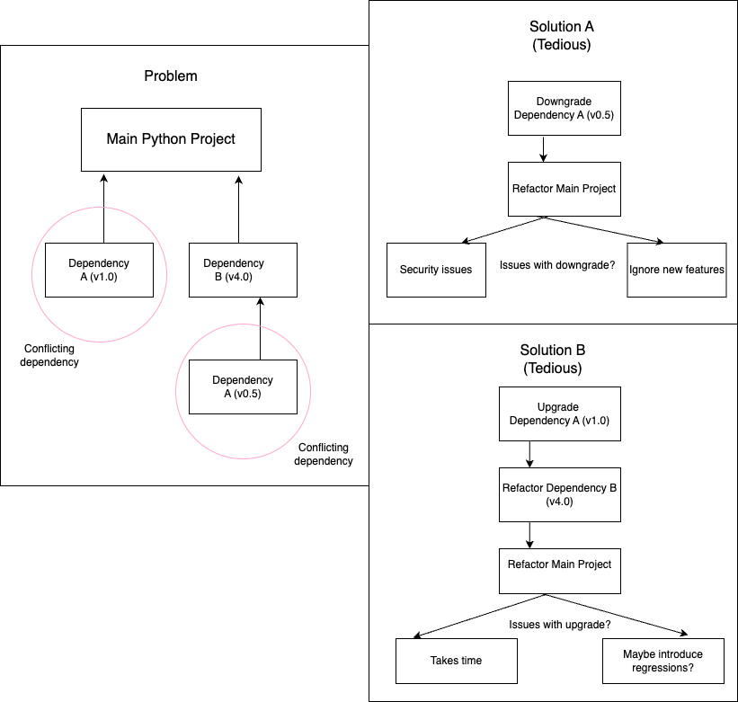
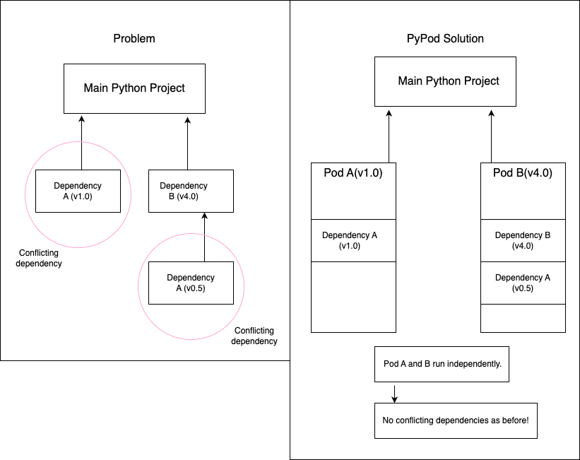
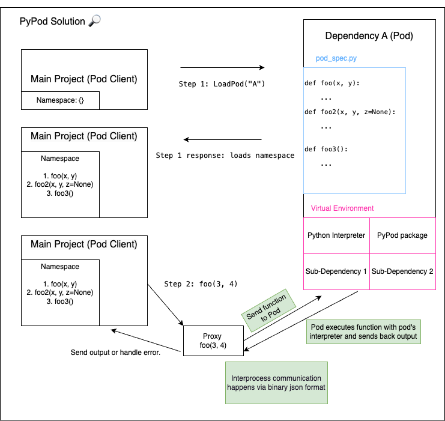

# PyPods

A lightweight solution to execute Python dependencies in an isolated fashion.

This documentation will follow the classic philosophy of [A picture is worth a thousand words](https://en.wikipedia.org/wiki/A_picture_is_worth_a_thousand_words)
# Problem


# Solution


# PyPod 🔎


# Terminology
1. ```pods``` directory stores all the pods that will be used in the current project.
2. A ```pod``` 

# How to use PyPods?

1. Install pypods package via ```pip install pypods```
2. From the project's ```root``` directory, create a file (say ```client.py```) and paste the following code.
```python
# client.py will communicate with the hello_world_pod pod
from pypods.pods import PodLoader

# name of the pod, and namespace to inject pod's functions.
pl = PodLoader("hello_world_pod", globals())
pl.load_pod()   # Load pod's namespace
pl.unload_pod() # Unload pod's namespace
```
if ```hello_world_pod``` does not exist then ```PodLoader``` will create a
```hello_world_pod``` pod inside of the ```pods``` directory. 

3. Navigate to ```pods/hello_world_pod/``` directory and observe the file structure.

```bash
hello_world_pod/
│
├── venv/
│   ├── bin/          (or Scripts/ on Windows)
│   ├── include/
│   ├── lib/
│   └── pyvenv.cfg
│
├── pod.py
├── requirements.txt
```

4. You can define functions inside a placeholder defined in the ```pod.py``` template file. Please don't change anything else in this file!

```python
# Template pod.py file inside the hello_world_pod pod.
"""
Write your module's functions in this area.
"""
def foo(x, y):
    return x + y

# Don't change anything here!
if __name__ == "__main__":
    from pypods.pods import PodListener
    pl = PodListener()  # PodListener will send output back to the pod client.
    msg = (
        pl.read_stdin()
    )  # Pod client writes function name and parameters to pod's stdin.
    if msg:
        # Unpack stdin to get function data
        function_name, args, kwargs = msg["name"], msg["args"], msg["kwargs"]
        try:
            # Check if function exists in pod module's namespace.
            # If yes, execute the function and send output back to the pod client.
            # If no, send error back to the pod client.
            if function_name in globals():
                function_output = globals()[function_name](*args, **kwargs)
                pl.write_stdout(function_output)
            else:
                pl.write_stderr(f"Function {function_name} does not exist in pod")
        except Exception as e:
            # Any error that occurs while calling the function is sent back to pod client.
            pl.write_stderr(str(e))
```

5. Go back to ```client.py``` and add the ```foo``` function.
```python
# client.py will communicate with the hello_world_pod pod
from pypods.pods import PodLoader

# name of the pod, and namespace to inject pod's functions.
pl = PodLoader("hello_world_pod", globals())
pl.load_pod()   # Load pod's namespace (This will now load the foo function).
foo_output = foo(1, 2) # Expected output = 1 + 2 = 3.
pl.unload_pod() # Unload pod's namespace
```

This demo shows how PyPod works. You ran a pod function ```foo``` without importing it into the ```client.py``` file!

# Author
Rohan Deshpande, PyPods 2024.
Inspired by the idea of [Babashka pods](https://github.com/babashka/pods).