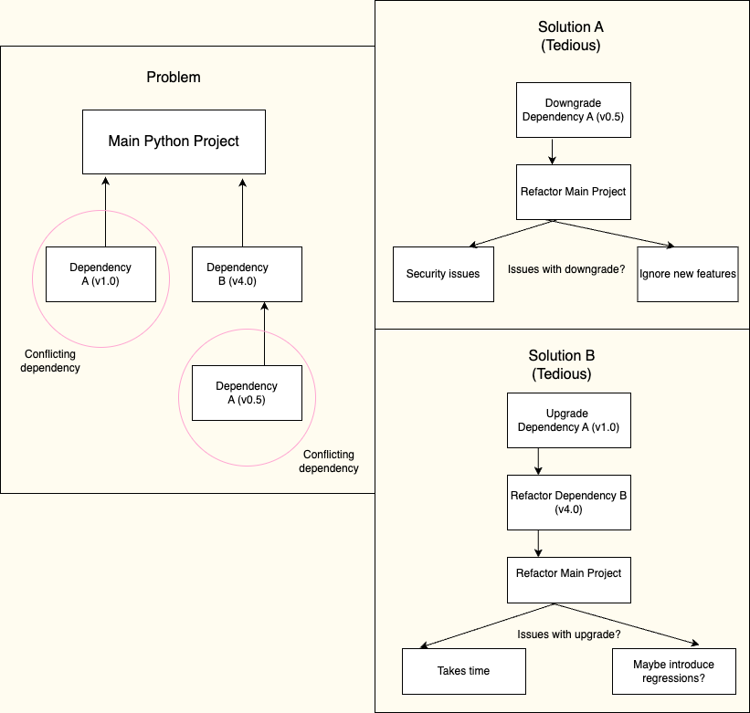
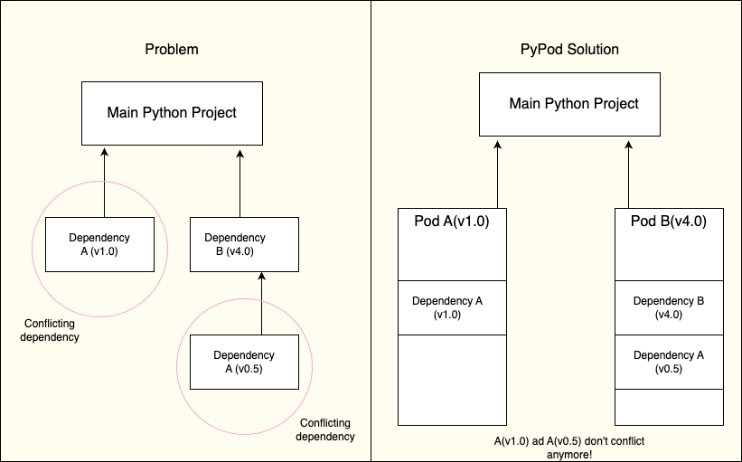
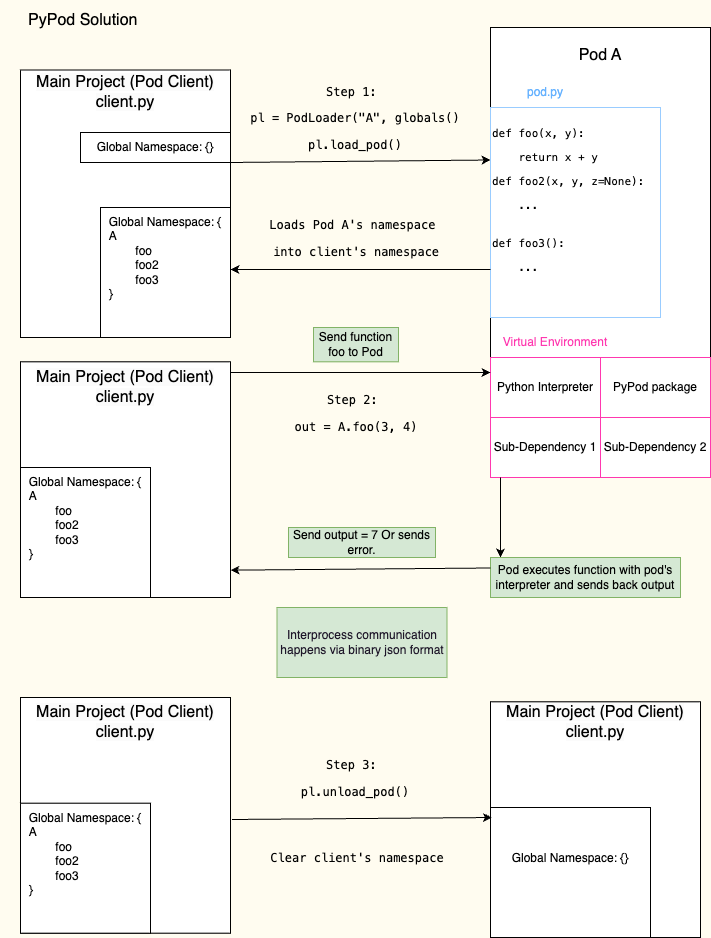

# PyPods

A lightweight solution to execute Python dependencies in an isolated fashion.

This documentation will follow the classic philosophy of [A picture is worth a thousand words](https://en.wikipedia.org/wiki/A_picture_is_worth_a_thousand_words)
# Problem


# Solution


# PyPod 🔎

# How?
1. Inside your root project directory, create a pods folder.
2. Create a directory within the pods folder. The name of the directory will be your pod name.
3. Inside the pod directory, create a ```pod_spec.py``` file. This file represents the actual pod.
The pod client will communicate with the pod to perform certain functions. 

# Author
Rohan Deshpande, PyPods 2024